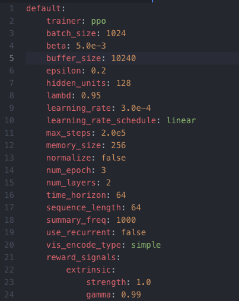
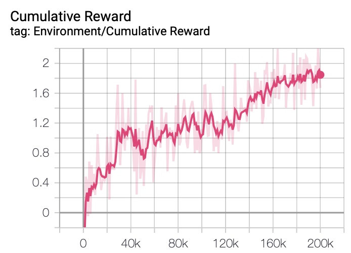

# UnityMachineLearning
## Case Study of ML-Agents
### Study #1 - SquareChar (work in progress):

Recently I have created a 2D-scene where the agent is a square character and the target is a box relatively close to the agent. The configuration for the environment is the following:

Goal: the agent moves towards the box

Rewards: 1 for reaching the target, -0.1 for going out of bounds, -0.001 for every step where the agent has not reached the target

Observations: The position of the target (Vector3), The position of the agent (Vector3), The x and y velocity of the agent (both floats)

Action Space: Continuous, two points that combine to create a direction vector for the force applied to the Rigidbody2D component of the agent and then multipled by some scalar "speed"

Reset Condition: The agent has gone outside of the bounds set in the agent script

Orange box: Agent, Green box: Target, Red box: Agent boundaries, Blue box: Target respawn area

  

  
   

Agent script can be found at: https://github.com/CooperR97/UnityMachineLearning/blob/master/squareCharML/Assets/SquareCharGame/Scripts/SquareCharAgent.cs

### Study #2 - MLLaneSmash2D (work in progress):

I have created another 2D-scene where the agent is circular character and the targets are enemy boxes that are coming towards the agent in random patterns. The configuration of the environment is the following:

Goal: survive the environment without gitting hit by an enemy

Rewards: 0.02 for every step where the agent does not hit an enemy, -2 for every step that the agent collides with an enemy, -5 for every time that the agent dies

Observations: The position of the agent (Vector3), a vector containing 1's and 0's representing the pattern of the enemies in the x position of the agent

Action Space: Discrete, which of the 3 positions is the agent going to snap to, determined by the discrete value of either 0, 1, or 2

Reset Condition: The agents health has reached 0. The agent is initialized with a health of 3 and is penalized one health point everytime it hits an enemy.

Orange Box: Agent, Arrows: represent the way elements in the environment can move

  

Agent script can be found at: https://github.com/CooperR97/UnityMachineLearning/blob/master/MLLaneSmash2D/Assets/Script/LaneAgent.cs

Adapted and modified from: https://github.com/Unity-Technologies/ml-agents
